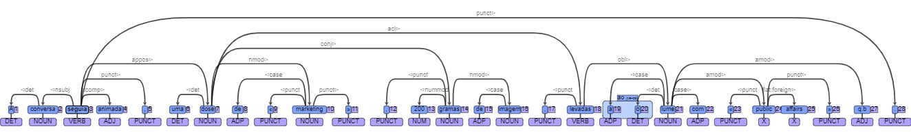
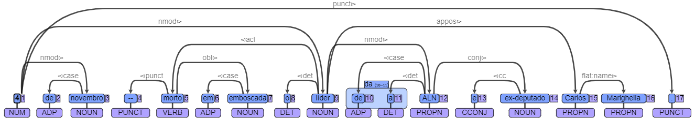
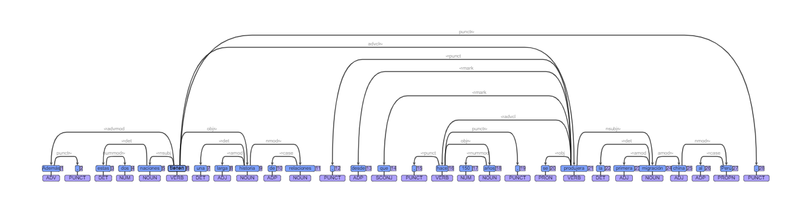
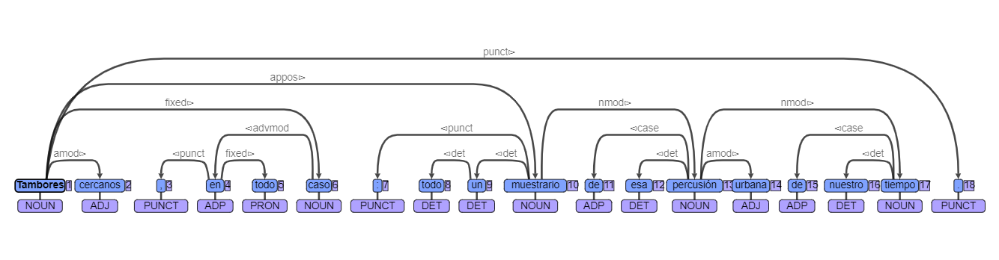
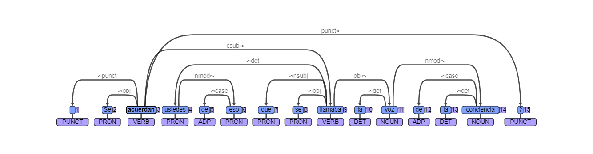
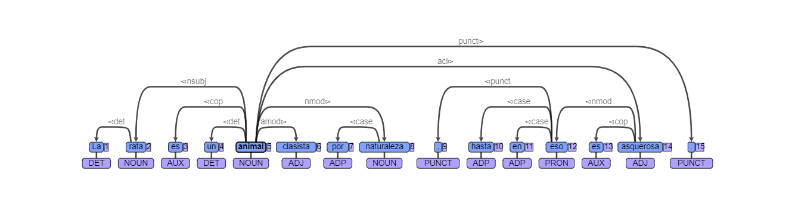
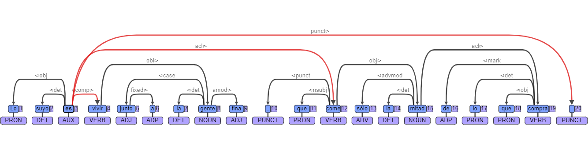

## Train, parse and evaluate using UDPipe

For this practical, I evaluated the types of errors that appear in the parser trained with a Universal Dependency treebank from [Portuguese](https://github.com/UniversalDependencies/UD_Portuguese-Bosque). First, a model was trained with the test file from the Portuguese treebank. A `pt.udpipe` model was produced. Then, the test data was parsed using this prevously trained model and an output file was generated `pt_test_out.conllu`. Finally, the performance of the output file was evaluated using the CoNLL-17 shared task evaluation [script](http://universaldependencies.org/conll17/eval.zip). 

The evaluation score was the following: LAS F1 Score: 83.28. This score reflects the percentage of correct times that a head was correctly labeled in the Portuguese test dataset.  

### Inspection of the trees in UD Portuguese
The second step in the process is to manually evaluate 10 trees from the `pt_test_out.conllu`. For convenience, this output file was compared with the test file from the Portuguese treebank.To do this, [UD Annotatrix](https://maryszmary.github.io/ud-annotatrix/standalone/annotator.html) was used for ease of visualization.  The first tree is presented below: 

The most noticeable error produced in this tree is the innacurate assignation of *isso* as the head of *E*. In this case the verb should be the head labeled with the demostrative pronoun. The cause for this error might be caused by the fact that this complex sentence is dividided by an internening verb between clauses.    

On the contrary, the tree in this simple sentence seems to be correctly parsed. 

In this tree, the noun `gramas` was not corectly labeled with its verbal head `levadas`.  

In this tree, the head `agendar` was incorrectly labeled with `pedir`. When this tree was compared with the test file, it was seen that `encontro` was the head of `pedir`.

This tree presents the date as the head of `lider` and even the punctuation at the end of the sentence. In this case, the contrary should have been tagged; `lider` as the head of the date and punctuation. 

### Inspection of the trees in UD Spanish

In the spirit of analyzing the Spanish treebank for my own project, I also evaluated the performance of the parser for this language. The same procedure as for the Poruguese treebank was followed.  

The evaluation score was the following: LAS F1 Score: 84.19. This score shows the percentage of correct times that a head was correctly labeled in the Spanish test dataset.  

Subsequently, five trees were evaluated as follows: 

Note that `Perú` was labeled with `China`. The case should be where `Perú` hould have been labeled with the head `migración`.

In this case `muestrario` should be the head of `todo` along with the article in `10`.

This nominal relative clause demonstrate that it is difficult for the parser to assign the correct dependencies. `Acuerdan` should be the head of `eso` and `eso` should be the head of the complement verb `llamaban`.

 
Here, the comma punctuation was assigned to the demonstrative pronoun `eso` in the second clause, instead of the noun `animal` in the first clause.

The pronoun `lo` was assigned to the verbal head `es` instead of the possesive pronoun `suyo`, which is the grammatical head for this pronoun. 

In conclusion, almost all trees contained parsing errors. Particularly, long, complex sentences are of special difficulty for the parsers. Despite this, the parser does an acceptable job in automatically assigning dependency structures in both Portuguese and Spanish. 